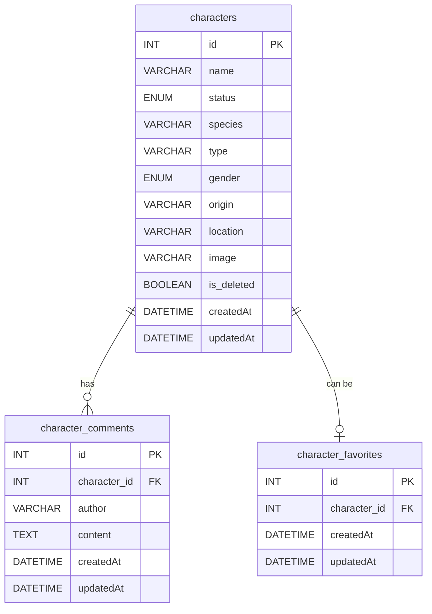

# ERD — Rick and Morty Database

Database: `rickandmorty_db`

## Relationships

- A `character` can have zero or many `character_comments` (one-to-many)
- A `character` can have zero or one `character_favorites` (one-to-one)
- When a character is deleted from `characters`, all related comments and favorites are deleted automatically (CASCADE)

## Notes

- `status` values: `Alive`, `Dead`, `unknown`
- `gender` values: `Female`, `Male`, `Genderless`, `unknown`
- `is_deleted` implements soft-delete — records are never physically removed